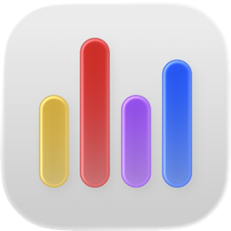
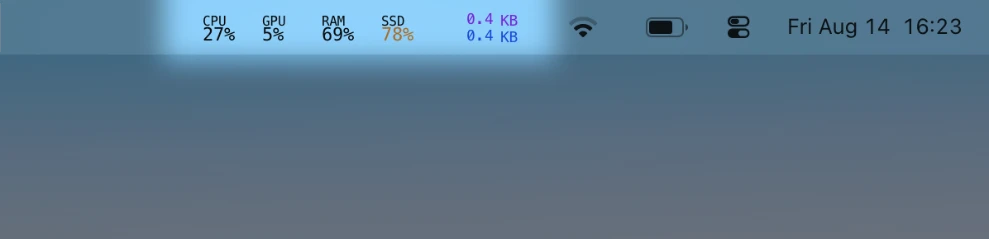

  <h1>
    <picture>
      <source media="(prefers-color-scheme: dark)" srcset="docs/glancebar-icon-dark.png">
      <source media="(prefers-color-scheme: light)" srcset="docs/glancebar-icon-light.png">
      
    </picture>&nbsp;GlanceBar
  </h1>
  
<strong>Lightweight system stats in the menu bar. <a href="https://github.com/nitodeco/glancebar/releases/latest/download/GlanceBar.dmg">Download GlanceBar for macOS.</a></strong>

## Features

- CPU, GPU, RAM, and SSD usage as percentages.
- Network stats for upload and download speed in KB/s or MB/s.
- Metrics can be enabled, disabled, and reordered.
- Configurable colors and thresholds for warnings.
- Configurable polling intervals to reduce resource usage.

## Contributing

See [CONTRIBUTING.md](CONTRIBUTING.md) for details.

## License

This project is licensed under the MIT License. See [LICENSE](LICENSE) for details.
