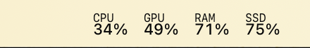

# GlanceBar

GlanceBar is a lightweight native macOS menu bar app for glanceable resource usage. It keeps CPU, GPU, memory, storage, and network activity visible without charts, popovers, notifications, or a web runtime.



## Features

- CPU, optional GPU, RAM, and SSD usage as compact percentages.
- Upload and download throughput with fixed-width network layout.
- Per-metric visibility and drag-and-drop ordering.
- Configurable polling interval, GPU polling multiplier, warning threshold, and critical threshold.
- Color presets plus advanced per-color HSL tuning.
- Auto contrast that follows the current menu bar appearance.
- Launch-at-login support.

## Requirements

- macOS 14 or newer
- Swift 6.2 or newer

## Quick Start

Download `GlanceBar.app.zip` from the latest GitHub Release, unzip it, and move `GlanceBar.app` to Applications.

On first launch, macOS may require opening it from Finder with Open unless the release has been Developer ID signed and notarized.

## Development

```sh
./Scripts/build-app.sh
open .build/release/GlanceBar.app
```

Click the menu bar item to open the menu. Choose Settings to configure metrics, colors, thresholds, and polling.

Build the executable:

```sh
swift build
```

Create a release `.app` bundle:

```sh
./Scripts/build-app.sh
```

Sign a release `.app` bundle:

```sh
GLANCEBAR_SIGNING_IDENTITY="Developer ID Application: Your Name (TEAMID)" ./Scripts/sign-app.sh
```

Create a zipped app archive:

```sh
GLANCEBAR_SIGNING_IDENTITY="Developer ID Application: Your Name (TEAMID)" ./Scripts/package-app.sh
```

Run tests:

```sh
swift test
```

## Settings

- Metrics can be enabled, disabled, and reordered.
- Launch at login can be enabled or disabled.
- CPU, GPU, RAM, and SSD values can turn yellow above the warning threshold and red above the critical threshold.
- GPU polling is optional and runs at a fixed multiple of the standard polling interval.
- Network upload and download colors are configured separately from threshold colors.
- Base text and label text colors can be set manually, or Auto contrast can adapt them to the menu bar appearance.

## Packaging

`./Scripts/build-app.sh` writes the app bundle to:

```text
.build/release/GlanceBar.app
```

`./Scripts/package-app.sh` writes the release archive to:

```text
dist/GlanceBar.app.zip
```

Release archives are signed with hardened runtime before they are zipped. Pushing a tag like `v0.1.0` creates a GitHub Release and uploads `GlanceBar.app.zip`.

GitHub release signing expects these repository secrets:

- `APPLE_CODESIGN_CERTIFICATE_BASE64`: Base64-encoded `.p12` signing certificate.
- `APPLE_CODESIGN_CERTIFICATE_PASSWORD`: Password for that `.p12`.

Set the repository variable `GLANCEBAR_SIGNING_IDENTITY` if the certificate identity is not uniquely matched by `Developer ID Application`.

## Behavior

- CPU, RAM, and network throughput update at the configured polling interval.
- GPU display is optional and polls at a configurable multiple of the standard polling interval.
- SSD usage updates every 30 seconds.
- Network units are shown as `KB` or `MB`, with up to one decimal place.
- Threshold colors apply to CPU, GPU, RAM, and SSD values only. Network values keep their configured upload and download colors.

## License

MIT. See `LICENSE`.
